##工作流 

工作流类似于一种流程式的操作，在由任务驱动的各种系统中都可以找到工作流，例如ERP、OA等。工作流总是以任务的形式驱动人处理业务或者驱动业务系统自动处理业务。工作流应用广泛，公司的请假流程、Timesheet解冻申请流程等都属于工作流。
假如让我们自己来维护一套业务流程，那么我们首先需要分析该业务，然后针对该业务设计表结构，最后维护各种表之间的关系。由于这个流程都是针对这个业务的，只能处理该业务，不能达到通用的要求，因此我们就会自然的想到将这些可变的流程式操作抽象出来，做出一个系统来维护。实际上，大多数工作流框架也是使用这种思路来维护业务流程的，因此学习工作流框架的表结构、表结构之间的关系、组件、操作流程的API就成为了重点。
#####工作流的生命周期
1. 定义：由业务人员收集业务需求并转化为流程定义，然后交给开发人员加工转化为可运行的流程定义
2. 发布：由开发人员打包各种资源，然后在平台上发布流程定义
3. 执行：流程引擎按照发布的流程定义文件以任务驱动的方式执行业务逻辑
4. 监控：用户在办理任务的同时收集每个任务的结果，然后根据结果做出处理（此阶段属于使用阶段）
5. 优化


##Activities
#####名称的由来
工作流由多个环节串联起来，并且每个环节被赋予了任务，每个任务由多个活动完成，活动即为Activity，工作流使用Activity的复数形式表示，即为Activities，最后将Activities简化为了Activiti。

##### 数据持久化
> Activiti使用MyBatis与数据库进行交互，完成数据的持久化。

#####引擎Service接口
> Activiti提供了七大Service接口，这些接口均可以通过ProcessEngine获取，并且支持链式调用，七大Service接口及其作用如下表所示：

|Service接口|作用|
|----|----|
|RepositoryService|流程仓库Service，用于管理流程仓库，例如部署、读取、删除流程资源|
|IdentifyService|身份Service，用于管理和查询用户、组以及用户和组之间的关系|
|RuntimeService|运行时Service，用于管理所有正在运行的流程实例、任务等|
|TaskService|任务Service，用户查询和管理任务，例如任务的签收、任务的办理、任务的指派|
|FormService|表单Service，用于读取和流程、任务相关的表达数据|
|HistoryService|历史Service，用于查询所有历史数据，例如流程实例、任务、活动、变量、附件等|
|ManagementService|引擎管理Service，用于查询引擎丰配置、数据库、作业等、和具体业务无关|

#####Activiti架构与组件

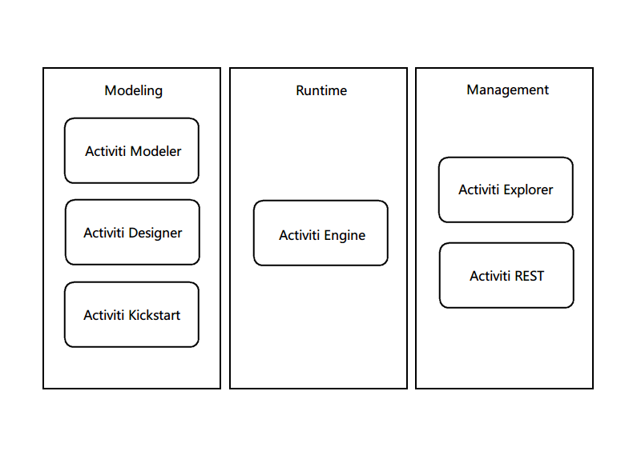

* Activit Engine：提供针对BPMN 2.0 规范的解析、执行、创建、管理（流程实例、任务）、查询历史记录并根据结果生成报表
* Activiti Modeler：模型设计器（适用于业务人员）
* Activiti Designer：模型设计器（适用于开发人员），目前没有完全支持 BPMN 2.0 规范。在使用时，可以将业务人员使用Activiti Modeler设计的流程定义文件导入到Activiti Designer中，从而让开发人员将其进一步加工成为可以运行的流程定义
* Activiti Explorer：管理仓库、用户、组，启动流程，任务办理等，可以作为后台管理员的流程、任务管理系统使用
* Activiti REST：提供Restful风格的服务，允许客户端以JSON的方式与引擎的REST API交互，具有夸平台、夸语言的特性


##获取Activiti
#####下载Activiti
使用浏览器访问[官网](http://activiti.org/download.html)，如果下载出现问题或下载速度慢，也可以访问[这里](https://pan.baidu.com/s/1c158x6g)

#####目录结构

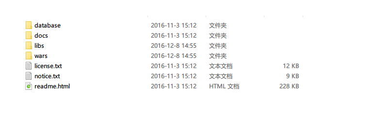
* database：包含了针对Activiti引擎表的创建、删除、版本升级三种类型的脚本
* docs：包含了三种文档：javadocs、userguid、xsd
> * userguid：用户手册，包含环境配置、10分钟快速入门、各个功能模块的使用教程
> * xsd：包含与流程定义的schema

* libs：包含了Activiti引擎的各个模块的class文件以及源码
* wars：官方给出的示例，部署在tomcat或jboss等Web服务器中，启动服务器，然后在浏览器中访问 http://localhost:8080/activiti-explorer 即可。

下面通过Javadocs对Activiti每个包的功能以及各个接口的作用做一下介绍：
* org.activiti.engine ：包含七大类Service接口、异常类、流程引擎、流程引擎配置，主要的类或接口有：
> * ProcessEngine（流程引擎）
> * ProcessEngineConfiguration（流程引擎配置）
* org.activiti.engine.delegate：定义了监听器的规范，主要的类或接口有：
> * ExecutionListener（执行监听器）
> * TaskListener（任务监听器）
* org.activiti.engine.form：用来对内置表单进行操作，主要的类或接口有：
> * FormService
* org.activiti.engine.history：用来对历史数据进行操作，主要的类有：
> * HistoricProcessInstance（历史流程实例）
> * HistoricTask（历史任务）
> * HistoricActiviti（历史活动）
> * HistoricDetail（历史详细）
> * HistoryService
* org.activiti.engine.identity：用来管理身份和认证，主要的类或接口有：
> * IdentifyService
* org.activiti.engine.management：用来管理流程引擎，主要的类或接口有：
> * ManagementService
* org.activiti.engine.query：定义了查询的共有特性，并不包含具体的功能，主要的类或接口有：
> * XxxQuery
* org.activiti.engine.repository：用来对流程资源进行管理与查询，主要的类或接口有：
> * RepositoryService
* org.activiti.engine.runtime：查询运行时数据，挂起和恢复流程，主要的类或接口有：
> * RuntimeService
* org.activiti.engine.task：包含任务对象的定义，任务的创建、删除，任务的指派，批注管理，附件管理，变量查询，主要的类或接口有：
> * TaskService
* org.activiti.engine.test：为创建测试用例提供基类和注解，支持注解的方式自动部署流程定义，使用到的注解主要有：
#####初始化数据库
初始化脚本路径：activiti-5.22.0\database\create
根据需要选择对应的初始化脚本，执行该脚本即可创建好数据库。此外也可以通过Activiti自动完成数据库的初始化。
创建好的数据库如下所示：
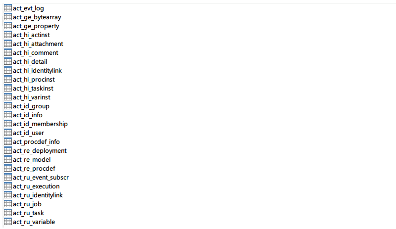
下面对初始化后的数据库中的表做一下简单的介绍
* ACT_RE_*: 'RE'表示repository。 这个前缀的表包含了流程定义和流程静态资源 （图片，规则，等等）
* ACT_RU_*: 'RU'表示runtime。 这些运行时的表，包含流程实例，任务，变量，异步任务，等运行中的数据。 Activiti只在流程实例执行过程中保存这些数据， 在流程结束时就会删除这些记录。 这样运行时表可以一直很小速度很快
* ACT_ID_*: 'ID'表示identity。 这些表包含身份信息，比如用户，组等等
* ACT_HI_*: 'HI'表示history。 这些表包含历史数据，比如历史流程实例， 变量，任务等等
* ACT_GE_*: 通用数据， 用于不同场景下
|表名|含义|
|----|----|
|act_evt_log|用于存储事件日志，默认没有开启|
|act_ge_bytearray|用来保存部署文件的大文本数据，例如流程定义文件、流程图片|
|act_ge_property|属性数据库，用来保存工作流框架级别的数据|
|act_hi_actinst|历史节点表，用来存放历史节点的信息，例如：节点名称、类型、委托人、开始时间、结束时间、耗时等|
|act_hi_attachment|历史附件表，存储历史附件|
|act_hi_comment|历史意见表，存储历史意见|
|act_hi_detail|历史详情表，保存流程中产生的变量详细、控制流程流转的变量、业务表单中填写的变量等|
|act_hi_identitylink|存放历史任务与办理人的关系|
|act_hi_procinst|历史流程实例表，存储历史流程实例|
|act_hi_taskinst|历史任务表，存储历史任务|
|act_hi_varinst|历史变量表，存储历史变量|
|act_id_group|组信息表|
|act_id_info||
|act_id_membership|用于与组的关系表|
|act_id_user|用户的基本信息|
|act_procdef_info|* 流程定义的动态变更信息|
|act_re_deployment||
|act_re_model||
|act_re_procdef|* 存储流程定义|
|act_ru_event_subscr|* 事件监听|
|act_ru_execution|* 流程实例与分支|
|act_ru_identitylink|* 参与者|
|act_ru_job|* 异步作业|
|act_ru_task|* 任务|
|act_ru_variable|* 流程变量|

##配置文件介绍
Activiti的基本配置文件
```XML
<?xml version="1.0" encoding="UTF-8"?>
<beans xmlns="http://www.springframework.org/schema/beans"
       xmlns:xsi="http://www.w3.org/2001/XMLSchema-instance"
       xsi:schemaLocation="http://www.springframework.org/schema/beans   http://www.springframework.org/schema/beans/spring-beans.xsd">

  <bean id="processEngineConfiguration" class="org.activiti.engine.impl.cfg.StandaloneProcessEngineConfiguration">

    <property name="databaseType" value="h2">


    <property name="jdbcUrl" value="jdbc:h2:mem:activiti;DB_CLOSE_DELAY=1000" />
    <property name="jdbcDriver" value="org.h2.Driver" />
    <property name="jdbcUsername" value="sa" />
    <property name="jdbcPassword" value="" />


    <property name="databaseSchemaUpdate" value="true" />

    <property name="jobExecutorActivate" value="false" />

    <property name=history value="full">

    <property name="asyncExecutorEnabled" value="true" />
    <property name="asyncExecutorActivate" value="false" />

    <property name="mailServerHost" value="mail.my-corp.com" />
    <property name="mailServerPort" value="5025" />
  </bean>
</beans>
```

在上述的配置文件中使用了StandaloneInMemProcessEngineConfiguration作为Activiti的引擎配置管理器，通过Eclipse查看该类的源代码
1. 在Eclipse中查找这个类（快捷键 Ctrl+Shift+T）
2. 输入类的名称点击查找
3. 该类的内容如下所示（如果没有出现以下内容，说明你需要为该类关联源码）：
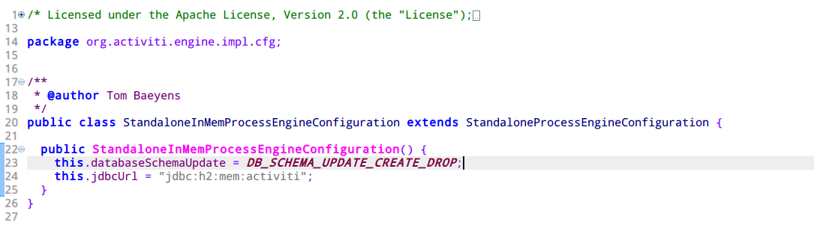
在StandaloneInMemProcessEngineConfiguration类中仅仅包含databaseSchemaUpdate属性和jdbcUrl属性，并没有其他属性，所以我们还需要查看StandaloneInMemProcessEngineConfiguration类的父类StandaloneProcessEngineConfiguration
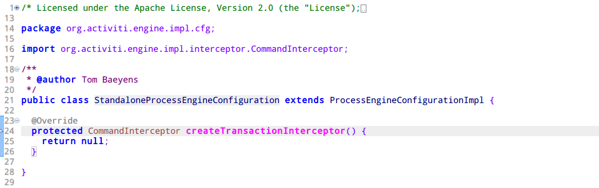
发现在StandaloneProcessEngineConfiguration类中仍然没有我们需要的属性，继续向上查找，直到ProcessEngineConfiguration类
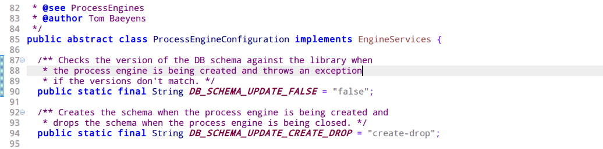
打开Outline视图（Window->Show View->Outline)，在ProcessEngineConfiguration类中，我们发现有许多在配置文件中出现的属性。例如：asyncExecutorEnabled、asyncExecutorActivate、jdbcDriver、jdbcUrl等
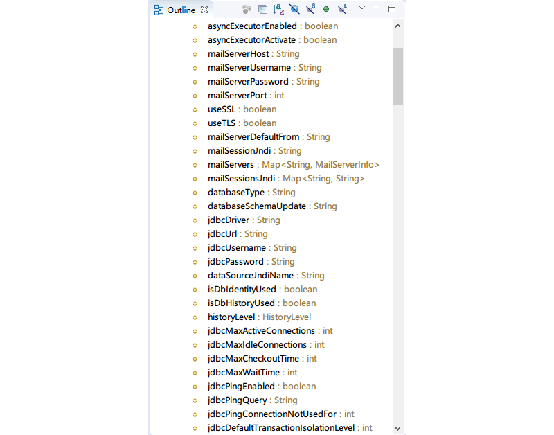
我们可以通过这种方式来寻找需要配置的属性，包括通过配置文件或者通过java代码动态配置。

下面针对该的配置文件进行简单的说明

|属性名称|属性说明|
|----|----|
|databaseType|数据库类型，，默认为H2，当使用非H2数据库时需要声明，Activiti支持的数据库有：H2、Mysql、Oracle、Postgres、MSSQL、DB2|
|databaseSchemaUpdate|声明数据库脚本更新策略 false：什么都不做；true：当Activiti的表不存在时自动创建（当Activiti的jar文件中定义的版本号与数据库中记录的版本号不一致时自动执行相应的升级脚本）；create-drop：创建爱你引擎是执行初始化脚本，引擎销毁时执行数据库删除脚本|
|jobExecutorActivate|设置时候启用作业执行功能，默认为false。当为true时，Activiti引擎会不间断的刷新数据库的作业表，检查是否存在需要执行的作业|
|history|设置记录历史的级别，默认值为audit。none：不保存任何历史记录；activity：保存所有的流程实例、任务、活动信息；audit：保存所有的流程实例、任务、活动信息、表单属性；full：最完整的历史记录，除了包含audit级别的信息之外还保存流程变量等信息|

##编写Hello World示例程序
###搭建开发环境
针对没有接触的Maven的用户，可以新建Web项目或Java项目，然后将目录activiti-5.22.0\activiti-5.22.0\libs下的jar全部导入到项目的lib目录下即可搭建出Activiti开发环境；
对于使用Maven的用户，可以通过Maven来创建Activiti的开发环境
1. 确定项目路径
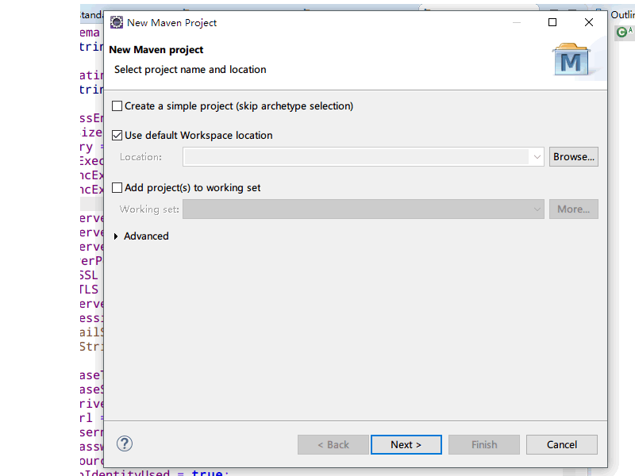
2. 确定Maven项目类型
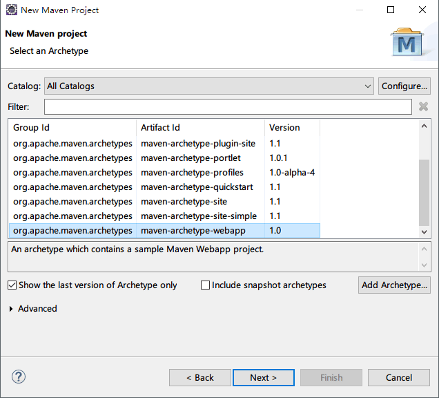
3. 确定GroupID、ArtifactID、Version
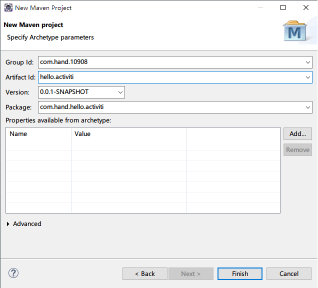
4. 添加依赖
```XML
<properties>
    <activiti-version>5.18.0</activiti-version>
  </properties>
  <dependencies>
  	<dependency>
      <groupId>org.activiti</groupId>
      <artifactId>activiti-engine</artifactId>
      <version>${activiti-version}</version>
    </dependency>
    <dependency>
      <groupId>org.activiti</groupId>
      <artifactId>activiti-spring</artifactId>
      <version>${activiti-version}</version>
    </dependency>
    <dependency>
      <groupId>org.slf4j</groupId>
      <artifactId>slf4j-api</artifactId>
      <version>1.7.6</version>
    </dependency>
    <dependency>
      <groupId>org.slf4j</groupId>
      <artifactId>slf4j-jdk14</artifactId>
      <version>1.7.6</version>
    </dependency>
    <dependency>
      <groupId>junit</groupId>
      <artifactId>junit</artifactId>
      <version>4.11</version>
    </dependency>
  </dependencies>
```
5. 编译项目
```shell
mvn compile
```
####创建流程定义文件，并部署
```XML
<?xml version="1.0" encoding="UTF-8"?>
<definitions xmlns="http://www.omg.org/spec/BPMN/20100524/MODEL" xmlns:xsi="http://www.w3.org/2001/XMLSchema-instance" xmlns:xsd="http://www.w3.org/2001/XMLSchema" xmlns:activiti="http://activiti.org/bpmn" xmlns:bpmndi="http://www.omg.org/spec/BPMN/20100524/DI" xmlns:omgdc="http://www.omg.org/spec/DD/20100524/DC" xmlns:omgdi="http://www.omg.org/spec/DD/20100524/DI" typeLanguage="http://www.w3.org/2001/XMLSchema" expressionLanguage="http://www.w3.org/1999/XPath" targetNamespace="http://www.activiti.org/test">
    <process id="myProcess" name="My process" isExecutable="true">
        <startEvent id="startEvent1" name="Start Event 1"></startEvent>
        <endEvent id="endEvent1" name="End Event 1"></endEvent>
        <sequenceFlow id="flow1" name="Flow 1" sourceRef="startEvent1" targetRef="endEvent1"></sequenceFlow>
    </process>
</definitions>
```

下面针对流程定义文件进行简单的讲解
* `definitions`标签表示BPMN 2.0 规范中定义的开始，在`<definitions>`标签中可以包含多个`<process>`用来表示多个流程；XMLSchema用来验证XML内容是否规范；targetNamespace是必须的，用来声明名称空间，为了区分、归类流程定义，可以是任意文字
* `process`标签用来定义流程
* `startEvent`标签标识一个启动事件，定义流程的入口，当流程启动时总是以`startEvent`开始
* `endEvent`标签标识一个结束事件，定义流程的出口
* `sequenceFlow`标签用来描述哥哥流程节点之间的关系，`sourceRef`属性表示从哪里开始，`targetRef`属性表示到哪里结束

将创建好的流程定义文件部署到项目中的src/main/resources目录下
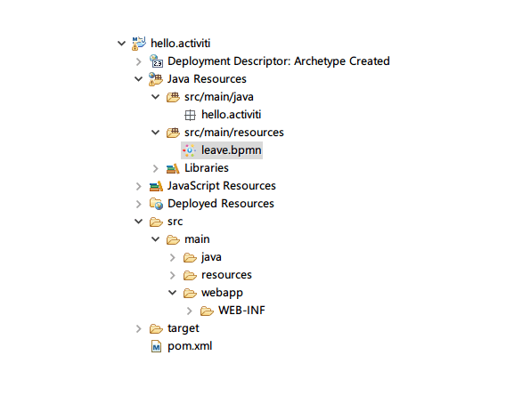

####创建单元测试类
```JAVA

```


